```mermaid
graph TD
    A[💡 Innovation] --> B[🔨 Development]
    B --> C[🧪 Testing]
    C --> D[🚀 Deployment]
    D --> E[📊 Monitoring]
    E --> F[🔄 Optimization]
    F --> A
    
    G[🎯 Planning] --> A
    H[📚 Learning] --> G
    I[🌟 Research] --> H
    
    style A fill:#ff6b6b,stroke:#fff,stroke-width:2px
    style B fill:#4ecdc4,stroke:#fff,stroke-width:2px
    style C fill:#45b7d1,stroke:#fff,stroke-width:2px
    style D fill:#96ceb4,stroke:#fff,stroke-width:2px
    style E fill:#feca57,stroke:#fff,stroke-width:2px
    style F fill:#ff9ff3,stroke:#fff,stroke-width:2px
    style G fill:#6c5ce7,stroke:#fff,stroke-width:2px
    style H fill:#fd79a8,stroke:#fff,stroke-width:2px
    style I fill:#fdcb6e,stroke:#fff,stroke-width:2px
```

[]()
<div align="center">
  
</div>

<div>
  
  


  ```javascript
const ashu_maurya = {
    🎯 role: "Full-Stack Alchemist 🧙‍♂️",
    📍 location: "Somewhere in the Cloud ☁️",
    🔥 currentFocus: "Distributed Systems & Microservices",
    💭 philosophy: "Code is poetry, systems are symphonies 🎵",
    ⚡ superpower: "Turning ☕ into scalable systems 🏗️",
    
    🕒 dailyRoutine: {
        🌅 morning: "☕ Coffee + 📊 System Metrics",
        🌞 day: "🔨 Building + 🐛 Debugging",
        🌆 evening: "📚 Learning + 🌟 Innovating",
        🌙 night: "💤 Dreaming in JSON"
    },
    
    ✨ stats: {
        🎯 codeQuality: "Production-Ready Always 🚀",
        🐛 bugCount: "Approaching Zero 🎯",
        ⚡ caffeineLevel: "Maximum",
        🔥 passionLevel: "Over 9000!"
    }
};
```


<div align="center">
  
</div>


</div>

<div align="center">
  
</div>


## <div align=center> **FullStack Developer [MERN Stack] & Programmer🧙‍♂️**</div>

- 🦾 Know about my experiences : <p align="center">[](https://ashutosh-portfolio-v3.vercel.app/)</p>
- 📠I regularly write blogs on : <p align="center">[](https://akmroyal.blogspot.com/?m=1)</p>
- ⚡ Fun fact **I'm CareFul with Your Work ! Not U 😏**

<div align="center">
  
</div>

## 🚀 My Featured Projects

| Project | Description | Tech/Year | Live/Repo |
|---------|-------------|-----------|-----------|
| 🎬 **Netflix Clone 2022**      | Full-featured streaming app, inspired by Netflix | ReactJS, TMDB API, 2022 | [🔗 Repo](https://github.com/akmroyal/Netflix-Clone.git) |
| 🌐 **Socio Web Design 2023**   | Modern social platform UI/UX | HTML, CSS, JS, 2023 | [🔗 Live](https://akmroyal.github.io/SocioWeb-App-Platform/) |
| 🖼️ **Portfolio 2022**          | Personal portfolio website | HTML, CSS, JS, 2022 | [🔗 Live](https://akmroyal.github.io/MyPortfolio/) |
| 💼 **Portfolio 2024**          | ReactJS-based portfolio, latest design | ReactJS, 2024 | [🔗 Repo](https://github.com/akmroyal/Demo-Portfolio-Design-ReactJS) |
| 📄 **ANY-2-ANY PDF Convertor** | Convert any file format to PDF seamlessly | NextJS, Vercel, 2024 | [🔗 Live](https://any-2-any-convrter-project.vercel.app/) |
| 📺 **VideoTube Full Stack**    | Scalable video hosting & social platform (like YouTube + Twitter) | MERN, Cloudinary, Tailwind, 2024 | [🔗 Live](https://ak-videotube.vercel.app/) |
| 🎮 **DevLaunchPad Multi Gaming & Tools** | Suite of web tools & games for devs | ReactJS, NodeJS, 2024 | [🔗 Repo](https://github.com/akmroyal/Dev-Launch-Pad-Tools-App.git) |
|🧑🏻‍💻 **CareerQuest**|CareerQuest is a modern job board platform which provides a seamless experience for both job seekers and employers.|MERN, Cloudinary, ShadCn etc.|[🔗Repo](https://github.com/akmroyal/CareerQuest-WebApp)|


<div align="center">
  
</div>

##  **TECH ARSENAL 🛠️**

<div align="center">
  
</div>

###  **💻 Frontend & Tools**
<div align="center">
  
  
  
  
  
  
</div>

###  **🚀 Backend Mastery**
<div align="center">
  
  
  
  
  
  
</div>


###  **🗄️ Database Wizardry**
<div align="center">
  
  <!--  -->
  
  
  <!--  -->
  <!--  -->
</div>

###  **☁️ Cloud & DevOps Arsenal**
<div align="center">
  
  
  <!-- 
  
  
   -->
</div>

<!-- line break -->
<div align="center">
  
</div>

##  **📊 GITHUB UNIVERSE**

<div align="center">
  
</div>

<div align="center">
  <table>
    <tr>
      <td>
        
      </td>
      <td>
        
      </td>
    </tr>
  </table>
</div>

<div align="center">
  
</div>

<!-- line break -->
<div align="center">
  
</div>

##  **CONNECT & COLLABORATE 🌐**

<div align="center">
  <a href="https://www.linkedin.com/in/ashu-maurya-9026xxxx/" target="_blank">
    
  </a>
  <a href="mailto:ashutosh.maurya2285@gmail.com">
    
  </a>
  <a href="https://twitter.com/akm_royals">
    
  </a>
  <a href="https://medium.com/@yourhandle">
    
  </a>
  <a href="https://dev.to/yourhandle">
    
  </a>
  <a href="https://discord.gg/akmroyal">
    
  </a>
</div>

###  **Let's Build Together! 🤝**
<div align="center">
  
  
  
</div>

<div align="center">
  
</div>

##  **ACHIEVEMENT VAULT 🏆**

<div align="center">
  
</div>

<div align="center">
  
</div>

 

<div align="center">
  
</div>

---

##  **CODE METRICS DASHBOARD 📊**

<div align="center">
  
</div>

<div align="center">
  <table>
    <tr>
      <td></td>
      <td></td>
    </tr>
    <tr>
      <td></td>
      <td></td>
    </tr>
  </table>
</div>

<div align="center">
  
</div>

###  **⚡ Performance Metrics**
<div align="center">
  
  
  
  
</div>

<!-- line break -->
<div align="center">
  
</div>

##  **CURRENT MISSION 🎯**

<div align="center">
  


  <p>&nbsp; <br/></p>
</div>



###  **2025 Roadmap📈**
<div align="center">
  
  
  
  
</div>

<div align="center">
  
</div>
<!-- line break -->

##  **VISITOR ANALYTICS📊**

<!-- <div align="center">
  
</div> -->

<!--  

<div align="center">
  
</div>

--- -->

<div align="center">
  
</div>

<div align="center">
  <h3>💭 <em>"The function of good software is to make the complex appear to be simple."</em> - Martin Fowler</h3>
  <h2>🌟 <strong>Let's build something amazing together!</strong> 🌟</h2>
</div>

<div align="center">
  
</div>

<div align="center">
  
</div>
